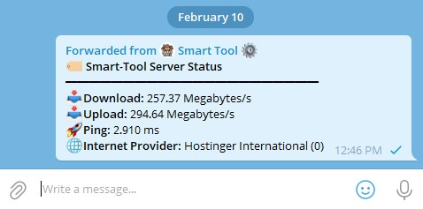

# 🚀 Pyrogram Speed Test Module

Welcome to the **Pyrogram Speed Test Module**! This module allows you to add speed test functionality to your Pyrogram bot using the `/ping`, `/speedtest`, and `/server` commands.

## Features

- 📥 **Download Speed Test**
- 📤 **Upload Speed Test**
- 🚀 **Ping Test**
- 🌐 **ISP Information**

## Prerequisites

- Python 3.7+
- Pyrogram and Speedtest modules

## Installation

1. **Install the required packages:**

    ```sh
    pip install pyrogram speedtest-cli
    ```

2. **Create the `speedtest_handler.py` file:**

    ```python name=speedtest_handler.py
    import asyncio
    import speedtest
    from pyrogram import Client, filters
    from pyrogram.types import Message
    from pyrogram.handlers import MessageHandler
    from pyrogram.enums import ParseMode

    def run_speedtest():
        st = speedtest.Speedtest()
        st.get_best_server()
        st.download(threads=None)
        st.upload(threads=None)
        return st.results.dict()

    async def get_speedtest_results():
        loop = asyncio.get_event_loop()
        return await loop.run_in_executor(None, run_speedtest)

    async def send_server_status(client: Client, message: Message):
        # Notify the user that the speed test is in progress
        status_message = await message.reply_text("Running speed test, please wait...")

        # Get speedtest results asynchronously
        results = await get_speedtest_results()
        download_speed = results["download"] / 1_000_000  # Convert to Mbps
        upload_speed = results["upload"] / 1_000_000  # Convert to Mbps
        ping = results["ping"]
        isp = results["client"]["isp"]
        rating = results["client"].get("rating", "N/A")

        # Format response text
        response_text = (
            "<b>🏷️ Server Status</b>\n"
            "━━━━━━━━━━━━━━━━━━━━━━\n"
            f"📥<b>Download:</b> {download_speed:.2f} Megabytes/s\n"
            f"📥<b>Upload:</b> {upload_speed:.2f} Megabytes/s\n"
            f"🚀<b>Ping:</b> {ping:.3f} ms\n"
            f"🌐<b>Internet Provider:</b> {isp} ({rating})\n"
        )

        # Edit the status message with the results
        await status_message.edit_text(response_text, parse_mode=ParseMode.HTML)

    def setup_ping_handler(app: Client):
        # Create a MessageHandler for the /ping, /speedtest, and /server commands
        handler = MessageHandler(send_server_status, filters.command(["ping", "speedtest", "server"]) & (filters.group | filters.private))
        
        # Add the handler to the app
        app.add_handler(handler)
    ```

3. **Create the `main.py` file:**

    ```python name=main.py
    from pyrogram import Client
    from speedtest_handler import setup_ping_handler

    app = Client("my_bot", bot_token="YOUR_TELEGRAM_BOT_TOKEN")

    setup_ping_handler(app)

    app.run()
    ```

4. **Run your bot:**

    ```sh
    python main.py
    ```

## Usage

- Use the `/ping`, `/speedtest`, or `/server` commands in any chat with the bot to get the speed test results.

## Example



## License

This project is licensed under the MIT License. See the [LICENSE](LICENSE) file for details.

## Contributing

Feel free to open issues or submit pull requests. Contributions are welcome!

## Acknowledgements

- [Pyrogram](https://docs.pyrogram.org/)
- [Speedtest](https://pypi.org/project/speedtest-cli/)
- [Telegram Bot API](https://core.telegram.org/bots/api)

---

Made with ❤️ by [abirxdhack](https://github.com/abirxdhack)
